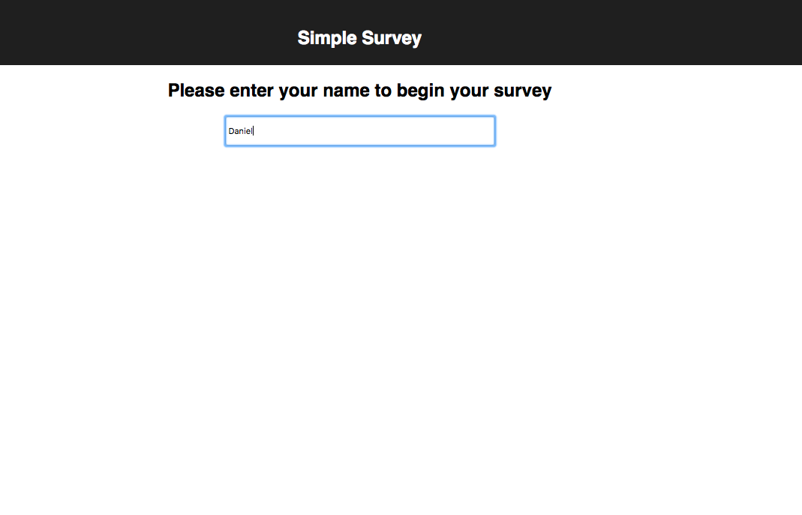
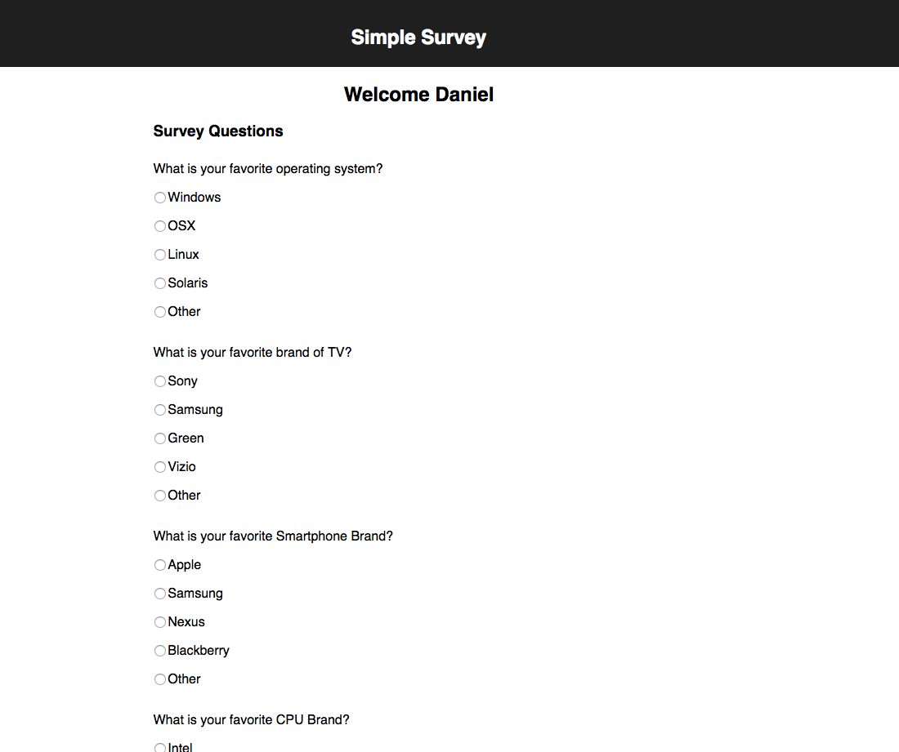
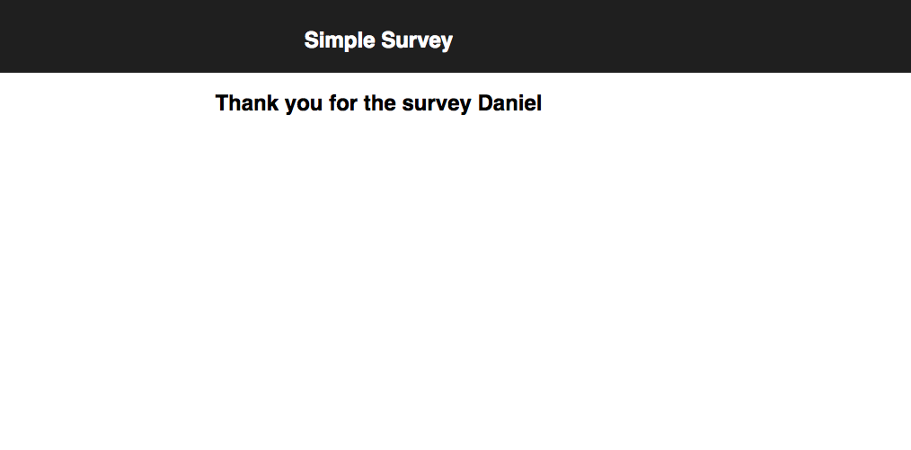

# Take a  test

## To run the app :

 * clone the app
 * cd in the project directory
 * npm install
 * npm start

#### 'Take a test' is a simple an basic app that uses ReactJS as a Front-End technology and Firebase as a database to store the user data

#### User can enter his name to start the survey

#### User can choose his favorite answers

#### A message for completing the survey is displayed

